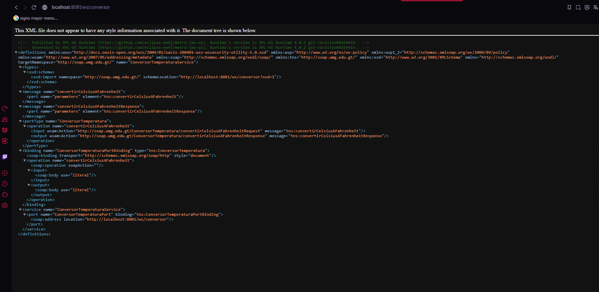
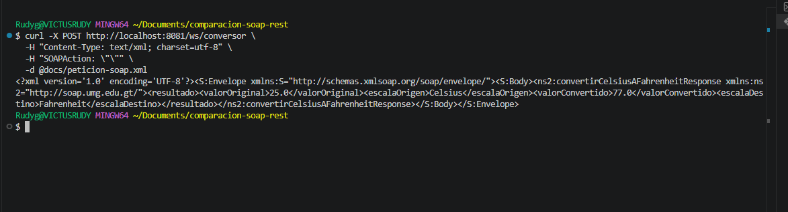
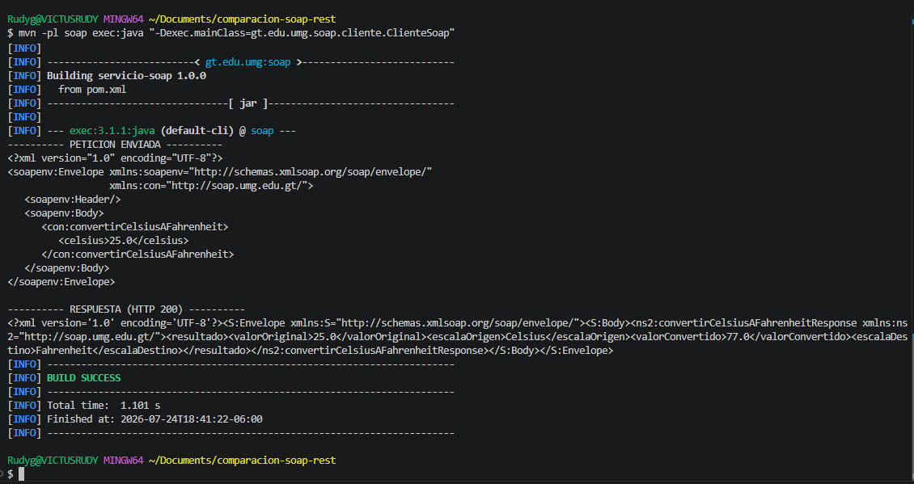
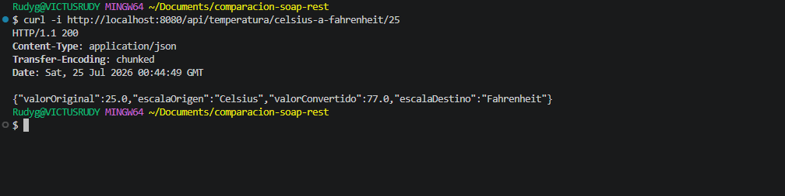
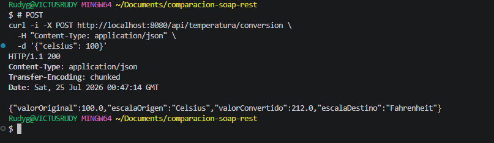
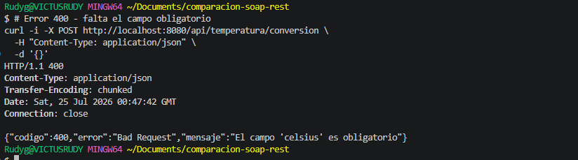

# Comparación SOAP vs REST

Proyecto académico que expone **la misma operación** mediante dos estilos de servicios web distintos:

- Un servicio **SOAP** con su contrato **WSDL**.
- Un servicio **REST** que responde en **JSON**.

**Operación implementada:** conversión de temperatura de grados Celsius a Fahrenheit.

```
F = (C × 9/5) + 32
```

---

## 1. Requisitos

| Componente | Versión |
|---|---|
| Java (JDK) | 17 o superior |
| Maven | 3.8+ |
| Sistema operativo | Cualquiera (Windows / Linux / macOS) |

Librerías principales:

| Módulo | Tecnología |
|---|---|
| `soap/` | Jakarta XML Web Services (JAX-WS RI `jaxws-rt` 4.0.2) |
| `rest/` | Spring Boot 3.3.4 (`spring-boot-starter-web`) |

Verificar las versiones instaladas:

```bash
java -version
mvn -version
```

---

## 2. Estructura del proyecto

```
comparacion-soap-rest/
│
├── README.md
├── .gitignore
├── pom.xml                     # POM padre (proyecto multi-módulo)
│
├── soap/                       # Servicio SOAP
│   ├── pom.xml
│   └── src/main/java/gt/edu/umg/soap/
│       ├── ConversorTemperaturaService.java   # servicio anotado (code first)
│       ├── ResultadoConversion.java           # bean JAXB -> <complexType> del WSDL
│       ├── PublicadorSoap.java                # publica el endpoint (main)
│       └── cliente/ClienteSoap.java           # cliente Java de prueba
│
├── rest/                       # Servicio REST
│   ├── pom.xml
│   └── src/main/
│       ├── java/gt/edu/umg/rest/
│       │   ├── AplicacionRest.java            # main de Spring Boot
│       │   ├── TemperaturaController.java     # endpoints GET y POST
│       │   └── Dtos.java                      # records de petición/respuesta
│       └── resources/application.properties
│
├── wsdl/
│   └── servicio.wsdl           # contrato del servicio SOAP
│
└── docs/
    └── peticion-soap.xml       # sobre SOAP de ejemplo
```

**Puertos utilizados:**

| Servicio | Puerto |
|---|---|
| SOAP | `8081` |
| REST | `8080` |

---

## 3. Cómo ejecutar el proyecto

### 3.1. Compilar todo

Desde la raíz del repositorio:

```bash
mvn clean package
```

### 3.2. Levantar el servicio SOAP

```bash
mvn -pl soap exec:java
```

O bien, usando el JAR generado:

```bash
java -jar soap/target/soap-1.0.0.jar
```

Salida esperada:

```
=================================================
 Servicio SOAP publicado correctamente
 Endpoint : http://localhost:8081/ws/conversor
 WSDL     : http://localhost:8081/ws/conversor?wsdl
 XSD      : http://localhost:8081/ws/conversor?xsd=1
 (Ctrl + C para detener)
=================================================
```

### 3.3. Levantar el servicio REST

En **otra terminal**:

```bash
mvn -pl rest spring-boot:run
```

O bien:

```bash
java -jar rest/target/rest-1.0.0.jar
```

---

## 4. Cómo consumir el servicio SOAP

### 4.1. Ver el WSDL

Abrir en el navegador:

```
http://localhost:8081/ws/conversor?wsdl
```

O descargarlo:

```bash
curl "http://localhost:8081/ws/conversor?wsdl" -o wsdl/servicio-generado.wsdl
```

> El archivo `wsdl/servicio.wsdl` incluido en el repositorio es la versión auto-contenida del contrato (con el esquema incrustado dentro de `<types>`). El WSDL generado en tiempo de ejecución es equivalente, pero separa el esquema en `?xsd=1`.

### 4.2. Con `curl`

```bash
curl -X POST http://localhost:8081/ws/conversor \
  -H "Content-Type: text/xml; charset=utf-8" \
  -H "SOAPAction: \"\"" \
  -d @docs/peticion-soap.xml
```

**Petición enviada:**

```xml
<?xml version="1.0" encoding="UTF-8"?>
<soapenv:Envelope xmlns:soapenv="http://schemas.xmlsoap.org/soap/envelope/"
                  xmlns:con="http://soap.umg.edu.gt/">
   <soapenv:Header/>
   <soapenv:Body>
      <con:convertirCelsiusAFahrenheit>
         <celsius>25</celsius>
      </con:convertirCelsiusAFahrenheit>
   </soapenv:Body>
</soapenv:Envelope>
```

**Respuesta obtenida (HTTP 200):**

```xml
<?xml version="1.0" ?>
<S:Envelope xmlns:S="http://schemas.xmlsoap.org/soap/envelope/">
  <S:Body>
    <ns2:convertirCelsiusAFahrenheitResponse xmlns:ns2="http://soap.umg.edu.gt/">
      <resultado>
        <valorOriginal>25.0</valorOriginal>
        <escalaOrigen>Celsius</escalaOrigen>
        <valorConvertido>77.0</valorConvertido>
        <escalaDestino>Fahrenheit</escalaDestino>
      </resultado>
    </ns2:convertirCelsiusAFahrenheitResponse>
  </S:Body>
</S:Envelope>
```

### 4.3. Con SoapUI

1. `File` → `New SOAP Project`.
2. **Initial WSDL:** `http://localhost:8081/ws/conversor?wsdl`.
3. SoapUI genera automáticamente la petición de ejemplo a partir del contrato.
4. Reemplazar el `?` del campo `celsius` por un número y ejecutar (botón verde).

### 4.4. Con el cliente Java incluido

```bash
mvn -pl soap exec:java -Dexec.mainClass=gt.edu.umg.soap.cliente.ClienteSoap
```

Con un valor distinto:

```bash
mvn -pl soap exec:java -Dexec.mainClass=gt.edu.umg.soap.cliente.ClienteSoap -Dexec.args="100"
```

### 4.5. Manejo de errores en SOAP

Si se envía un valor no numérico, el servicio no responde con un código HTTP de error, sino con un **`<soap:Fault>`** dentro del sobre (típicamente con HTTP 500). Esta es una diferencia central frente a REST.

---

## 5. Cómo consumir el servicio REST

### 5.1. `GET` — el valor viaja en la URL

```bash
curl -i http://localhost:8080/api/temperatura/celsius-a-fahrenheit/25
```

**Respuesta — `200 OK`:**

```json
{
  "valorOriginal": 25.0,
  "escalaOrigen": "Celsius",
  "valorConvertido": 77.0,
  "escalaDestino": "Fahrenheit"
}
```

### 5.2. `POST` — el valor viaja en el cuerpo JSON

```bash
curl -i -X POST http://localhost:8080/api/temperatura/conversion \
  -H "Content-Type: application/json" \
  -d '{"celsius": 100}'
```

**Respuesta — `200 OK`:**

```json
{
  "valorOriginal": 100.0,
  "escalaOrigen": "Celsius",
  "valorConvertido": 212.0,
  "escalaDestino": "Fahrenheit"
}
```

### 5.3. Códigos HTTP manejados

| Escenario | Código | Cuerpo |
|---|---|---|
| Conversión exitosa | `200 OK` | JSON con el resultado |
| Campo `celsius` ausente en el POST | `400 Bad Request` | JSON de error |
| Valor no numérico en la ruta | `400 Bad Request` | JSON de error |
| Ruta inexistente | `404 Not Found` | JSON de Spring |
| Verbo no permitido (ej. `DELETE`) | `405 Method Not Allowed` | JSON de Spring |

Pruebas de error:

```bash
# 400 - falta el campo obligatorio
curl -i -X POST http://localhost:8080/api/temperatura/conversion \
  -H "Content-Type: application/json" -d '{}'

# 400 - valor no numérico
curl -i http://localhost:8080/api/temperatura/celsius-a-fahrenheit/abc

# 404 - recurso inexistente
curl -i http://localhost:8080/api/temperatura/inexistente
```

**Respuesta de error — `400 Bad Request`:**

```json
{
  "codigo": 400,
  "error": "Bad Request",
  "mensaje": "El campo 'celsius' es obligatorio"
}
```

### 5.4. Con Postman

1. Nueva petición `GET` → `http://localhost:8080/api/temperatura/celsius-a-fahrenheit/25` → **Send**.
2. Nueva petición `POST` → `http://localhost:8080/api/temperatura/conversion`.
   - Pestaña **Body** → **raw** → tipo **JSON**.
   - Cuerpo: `{"celsius": 100}` → **Send**.

---

## 6. Evidencia de pruebas

Todas las pruebas se ejecutaron en Windows (Git Bash), con el servicio SOAP en el puerto `8081` y el servicio REST en el puerto `8080` corriendo simultáneamente.

| Prueba | Captura |
|---|---|
| WSDL en el navegador |  |
| Petición SOAP con `curl` |  |
| Cliente Java SOAP (`ClienteSoap`) |  |
| `GET` REST — `200 OK` |  |
| `POST` REST — `200 OK` |  |
| `POST` REST sin `celsius` — `400 Bad Request` |  |

---

## 7. Estructura del WSDL

El contrato se compone de cinco secciones. Van de lo más abstracto (los datos) a lo más concreto (la dirección física del servicio):

| Sección | Función | En este proyecto |
|---|---|---|
| **`types`** | Define los tipos de datos con XML Schema (XSD): qué elementos existen, de qué tipo son y si son obligatorios. Es el modelo de datos del contrato. | Declara los elementos `convertirCelsiusAFahrenheit` y `convertirCelsiusAFahrenheitResponse`, más el `complexType` `resultadoConversion`. |
| **`message`** | Unidad de comunicación. Agrupa una o varias `part`, y cada `part` apunta a un elemento definido en `types`. Se necesita un mensaje de entrada y uno de salida. | `convertirCelsiusAFahrenheit` (entrada) y `convertirCelsiusAFahrenheitResponse` (salida). |
| **`portType`** | Interfaz abstracta del servicio. Lista las operaciones y, para cada una, qué mensaje entra y cuál sale. Equivale a una interfaz Java: dice **qué** se puede hacer. | `ConversorTemperatura`, con la operación `convertirCelsiusAFahrenheit`. |
| **`binding`** | Enlaza el `portType` con un protocolo concreto: SOAP sobre HTTP, estilo `document`, uso `literal`. Dice **cómo** se transmite. | `ConversorTemperaturaPortBinding`. |
| **`service`** | Expone el servicio en una dirección real mediante uno o más `port`. Dice **dónde** está. | `ConversorTemperaturaService` en `http://localhost:8081/ws/conversor`. |

**Enfoque utilizado: _Code First_.** Se escribieron las clases Java anotadas con `@WebService`, `@WebMethod`, `@WebParam` y `@WebResult`, y el runtime de JAX-WS genera el WSDL automáticamente al acceder a `?wsdl`.

---

## 8. Flujo de ejecución

**SOAP:**

```
Cliente (SoapUI / curl / ClienteSoap)
   └─ HTTP POST con un sobre XML (Envelope + Body)
        └─ Servidor HTTP embebido (puerto 8081)
             └─ Runtime JAX-WS: valida el XML contra el XSD del WSDL
                  └─ JAXB deserializa el XML a parámetros Java (double celsius)
                       └─ ConversorTemperaturaService.convertirCelsiusAFahrenheit()
                            └─ JAXB serializa ResultadoConversion a XML
                                 └─ Se devuelve el sobre SOAP de respuesta
```

**REST:**

```
Cliente (Postman / curl)
   └─ HTTP GET o POST a una URL de recurso
        └─ Tomcat embebido (puerto 8080)
             └─ DispatcherServlet de Spring: enruta según URL + verbo
                  └─ Jackson deserializa el JSON al record PeticionConversion
                       └─ TemperaturaController.convertir()
                            └─ Jackson serializa RespuestaConversion a JSON
                                 └─ ResponseEntity define el código HTTP (200 / 400)
```

---

## 9. Cómo agregar un parámetro nuevo

Ejercicio típico de revisión: agregar la escala de destino como parámetro.

**En SOAP** (`ConversorTemperaturaService.java`):

```java
@WebMethod(operationName = "convertirCelsiusAFahrenheit")
@WebResult(name = "resultado")
public ResultadoConversion convertirCelsiusAFahrenheit(
        @WebParam(name = "celsius") double celsius,
        @WebParam(name = "decimales") int decimales) {   // <-- parámetro nuevo
    ...
}
```

Al recompilar y reiniciar, el WSDL se regenera solo: aparece un elemento `decimales` dentro del `complexType` de `convertirCelsiusAFahrenheit`, en `types`. **Todos los clientes existentes deben regenerar sus stubs.**

**En REST** (`Dtos.java`):

```java
public record PeticionConversion(
        @NotNull Double celsius,
        Integer decimales                                 // <-- parámetro nuevo
) {}
```

Los clientes que no envíen `decimales` siguen funcionando: el campo simplemente llega como `null`. **No se rompe nada.** Esta diferencia resume bien el contraste entre ambos modelos.

---

## Comparación entre SOAP y REST

_Responder en un párrafo breve (5 a 10 líneas):_

- ¿Qué diferencias encontraron al desarrollar ambos servicios?
- ¿Cuál fue más sencillo de implementar?
- ¿En qué casos usarían SOAP?
- ¿En qué casos usarían REST?


---

## Autor

Rudy González — Ingeniería en Sistemas
Universidad Mariano Gálvez de Guatemala, Campus Jutiapa
